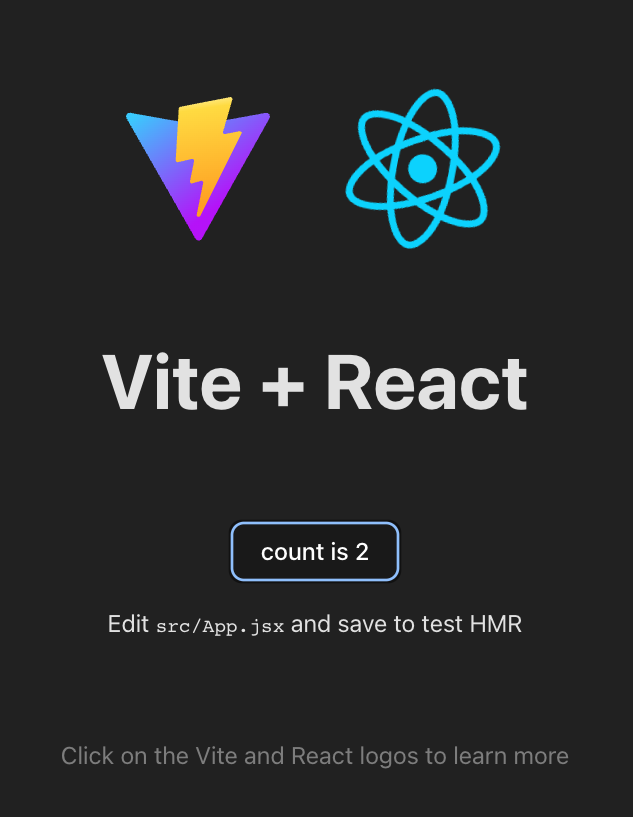

# roundtable-cicd


[contributors-shield]: https://img.shields.io/github/contributors/chingu-voyages/roundtable-cicd.svg?style=for-the-badge
[contributors-url]: https://github.com/chingu-voyages/roundtable-cicd/graphs/contributors
[forks-shield]: https://img.shields.io/github/forks/chingu-voyages/roundtable-cicd.svg?style=for-the-badge
[forks-url]: https://github.com/chingu-voyages/roundtable-cicd/network/members
[stars-shield]: https://img.shields.io/github/stars/chingu-voyages/roundtable-cicd.svg?style=for-the-badge
[stars-url]: https://github.com/chingu-voyages/roundtable-cicd/stargazers
[issues-shield]: https://img.shields.io/github/issues/chingu-voyages/roundtable-cicd.svg?style=for-the-badge
[issues-url]: https://github.com/chingu-voyages/roundtable-cicd/issues

[![Contributors][contributors-shield]][contributors-url]
[![Forks][forks-shield]][forks-url]
[![Stargazers][stars-shield]][stars-url]
[![Issues][issues-shield]][issues-url]



## roundtable-cicd

roundtable-cicd is a small Vite+ReactJS application used to test and demonstrate
CI/CD pipelines built on top of GitHub Actions. As such, it's purpose is purely
instructional and it's not intended to be a "production" quality application.

- [Process Overview](#process-overview) 
- [Installation](#installation) 
- [Usage](#usage) 
- [Release History](#release-history) 
- [License](#license)

## Process Overview

tbd

## Installation

To install this app:
```
git clone https://github.com/chingu-voyages/roundtable-cicd.git
npm i
```

To run the app check out the information in the *_'Usage'_* section below.

Seshatbot must be defined in the Discord server and granted administrator
permissions. 

## Usage

To start the app run this from you terminal session: 
```
npm run dev
```

Before running it you'll first need to identify option values you'll using 
in both the command line and the CLI `.env` file. 

| `.env` Parm    | Description                              |
|----------------|------------------------------------------|
|                | **Coming soon** |
 
It's important to keep in mind that options you supply on the command line
ALWAYS override the same option you specify in the `.env` file.

`env.sample` in the root of the project contains a sample of how to set up a `.env` file.


## Release History

You can find what changed, when in the [release history](./docs/RELEASE_HISTORY.md)

## License

Copyright 2023 &copy; Chingu, Inc.

Redistribution and use in source and binary forms, with or without modification, are permitted provided that the following conditions are met:

1. Redistributions of source code must retain the above copyright notice, this list of conditions and the following disclaimer.

2. Redistributions in binary form must reproduce the above copyright notice, this list of conditions and the following disclaimer in the documentation and/or other materials provided with the distribution.

3. Neither the name of the copyright holder nor the names of its contributors may be used to endorse or promote products derived from this software without specific prior written permission.

THIS SOFTWARE IS PROVIDED BY THE COPYRIGHT HOLDERS AND CONTRIBUTORS "AS IS" AND ANY EXPRESS OR IMPLIED WARRANTIES, INCLUDING, BUT NOT LIMITED TO, THE IMPLIED WARRANTIES OF MERCHANTABILITY AND FITNESS FOR A PARTICULAR PURPOSE ARE DISCLAIMED. IN NO EVENT SHALL THE COPYRIGHT HOLDER OR CONTRIBUTORS BE LIABLE FOR ANY DIRECT, INDIRECT, INCIDENTAL, SPECIAL, EXEMPLARY, OR CONSEQUENTIAL DAMAGES (INCLUDING, BUT NOT LIMITED TO, PROCUREMENT OF SUBSTITUTE GOODS OR SERVICES; LOSS OF USE, DATA, OR PROFITS; OR BUSINESS INTERRUPTION) HOWEVER CAUSED AND ON ANY THEORY OF LIABILITY, WHETHER IN CONTRACT, STRICT LIABILITY, OR TORT (INCLUDING NEGLIGENCE OR OTHERWISE) ARISING IN ANY WAY OUT OF THE USE OF THIS SOFTWARE, EVEN IF ADVISED OF THE POSSIBILITY OF SUCH DAMAGE.
